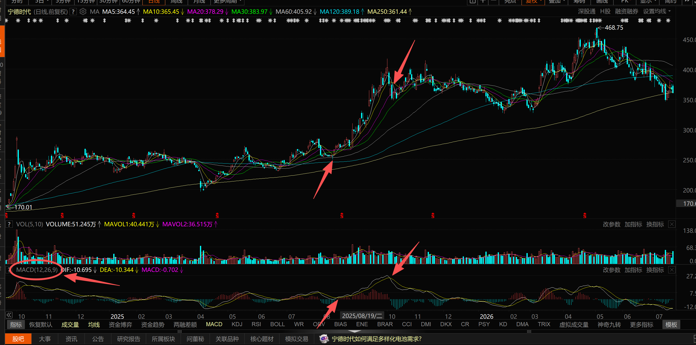
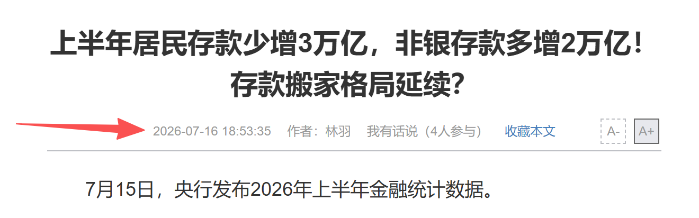
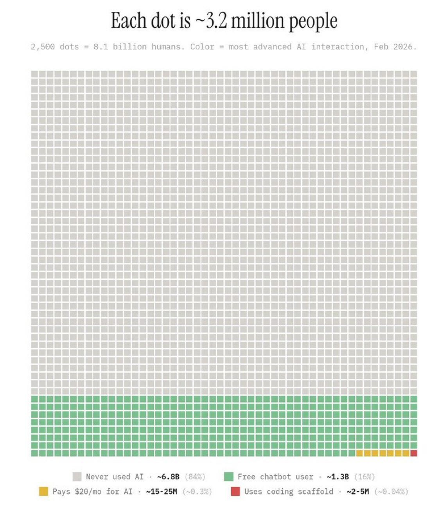

# 量化投资与AI

陈金牛 · 2026

<!--
听众摸底小调研

1. 是否用过AI做研究、写报告、写程序
2. 是否用过国外的AI（gemini，chatgpt，claude）
3. 是否炒股
4. 是否用AI辅助炒股

根据听众对AI掌握的情况，按需现场展示一下AI的能力
-->

---
layout: center
---

# 目录

- 什么是量化投资
- 对 AI 的一些思考

---
layout: section
---

# 量化投资简介

---

# 广义上说，一切投资都是量化投资

<v-clicks depth="1">

- 所有人都要依赖数字和消息炒股

# 特指：高度依赖IT技术，通过程序自动交易

- 高度自动化，尽量少的人工干预

# 区别：自动化程度，人工干预的方式

</v-clicks>

<v-clicks>

- 没有截然分明的边界
- 盘中程序给出实时提示，交易员决定是否交易
- 收盘后程序选股，第二天手工交易
- 极端行情发生时，手工拉闸断电

</v-clicks>

---

# 量化机构的如何分工

  <Card v-click title="投研">策略研发 组合管理 风控 <i>探索未知，“战争迷雾”</i></Card>
  <Card v-click title="IT">数据系统 回测系统 交易系统 <i>画图纸，盖大楼</i></Card>
  <Card v-click title="业务支持">市场 法务 行政、财务、人事</Card>

---

# 市场、频率与收益来源

  <Card v-click title="交易标的">票、债券 期货、期权 外汇等其他资产</Card>
  <Card v-click title="交易频率">中低频：周、月、季度 中高频：天 高频交易：分钟，秒，纳秒</Card>
  <Card v-click title="赚什么钱">投机：趋势跟踪，追涨杀跌 套利：趋势回归</Card>

<v-click>

- 频率越高，对延迟、手续费成本、市场容量和基础设施的要求越高
- 主要用到的 IT 技术：高性能计算，并行计算，数据库，大数据，机器学习，……

</v-click>

---

# 一个 Demo：量化投资视角下的 MACD

  <!-- 初始显示，第 1 次点击后消失 -->
  

    
  

  <ul class="absolute inset-0 list-disc pl-8 leading-8">
    <li v-click>听说 MACD 金叉死叉信号很有效</li>
    <li v-click>取出2000年以来的全部股票的5分钟线，做复权处理</li>
    <li v-click>剔除停牌的和交易不活跃的股票</li>
    <li v-click>按照某个参数组合计算活跃股票的金叉死叉信号</li>
    <li v-click>剔除涨停和跌停无法交易的情况</li>
    <li v-click>按照某种权重分配方式给产生信号的股票分配资金</li>
    <li v-click>观察参数组合的表现，选一个表现好的参数组合</li>
    <li v-click>逐月滚动，测试选中的参数组合在下个月的盈亏情况</li>
    <li v-click>得到结论：如果这么做，过去20年收益情况如何</li>
    <li v-click>小资金开始实盘验证</li>
    <li v-click>如果实盘验证结果和历史回测吻合，说明策略有效，可以分配更多资金</li>
  </ul>

---

# 常见量化产品

| **类型** | **核心思路** |
|---|---|
| 多因子选股 | 用价值、质量、动量等特征解释收益差异 |
| 指数增强 | 涨的比指数多、跌的比指数少，就行 |
| 统计套利 | 衍生品和标的物之间存在价差，原则上未来价差一定会归零 |
| 事件驱动 | 围绕公告、重组、业绩等事件交易，特朗普最擅长 |
| CTA | 交易原油、化工、农产品等大宗商品的期货合约 |
| 高频交易 | 从极短期价格与订单流中提取微弱信号 |
| 做市策略 | 持续双边报价，为市场提供流动性，赚取价差 |

---
layout: section
---

# 数据：量化投资的核心资产

---

# 数据即信息，和大模型的原理相仿

  <Card v-click title="市场公开数据">行情、公司公告、财务数据</Card>
  <Card v-click title="卖方与预期数据">卖方研报、一致预期、评级</Card>
  <Card v-click title="舆情数据">新闻、股吧、微博、社交媒体</Card>
  <Card v-click title="另类数据">卫星、物流、招聘、门店、供应链等</Card>

---

# 数据从哪里来

<v-clicks>

- 交易所、上市公司、政府统计部门
- 专业金融数据商：万德、财汇、恒生聚源、同花顺、东方财富、通联数据、……
- 新闻媒体与互联网平台
- 企业运营数据
- 第三方另类数据供应商，如卫星遥感数据
- 开源数据平台

</v-clicks>

---

# 非同质化数据为什么值钱

公开且标准化的数据会被大量机构同时使用，优势容易衰减。

  <Card v-click title="高同质化">容易获得、格式统一、竞争拥挤 信息增量往往较低</Card>
  <Card v-click title="低同质化">采集困难、处理复杂、覆盖独特 可能具有更高信息密度</Card>

---

# 以舆情数据为例

<v-clicks>

- 网页会消失，网站会倒闭
- 爬虫落地的历史数据是不可复现的价值巨大的资产
- 历史上很多网站的新闻只显示日期，没有时间字段
- 盘前、盘中、盘后，新闻的价值完全不同
- 日后再抓取网页，已经无法获知时间字段
- 只能依赖爬虫系统的实时时间戳

</v-clicks>

---

# 盘中与盘后：两个数据世界

<table>
  <thead>
    <tr>
      <th></th>
      <th><b>盘中实时数据</b></th>
      <th><b>盘后历史数据</b></th>
    </tr>
  </thead>
  <tbody>
    <tr v-click>
      <td>目标</td>
      <td>尽快驱动决策与交易</td>
      <td>稳定支持研究与回测</td>
    </tr>
    <tr v-click>
      <td>要求</td>
      <td>低延迟、完整连续、数据质量要求高</td>
      <td>高并发、高吞吐量、历史足够长</td>
    </tr>
    <tr v-click>
      <td>常见形态</td>
      <td>以数据流推送为主</td>
      <td>文件、数据库、大数据存储</td>
    </tr>
    <tr v-click>
      <td>故障代价</td>
      <td>错过交易或错误下单</td>
      <td>策略研发失真、错误</td>
    </tr>
  </tbody>
</table>

---

# 以股票 L2 数据为例

<v-clicks>

- 每只股票每 3 秒推送一条买卖 10 档盘口数据
- 全市场所有股票的每一笔挂单、撤单行为，和每一次撮合成交
- 每天 100G，压缩后 10G 左右，2007 年以来全历史数据约 3TB 左右

</v-clicks>

  <Card v-click title="盘中的挑战">
    <ul>
      <li>收到行情后，要在几个毫秒内完成策略计算并下单</li>
      <li>核心需求：低延迟</li>
    </ul>
  </Card>
  <Card v-click title="盘后的挑战">
    <ul>
      <li>多个策略，多组参数，在多台服务器上同时访问和计算全市场全历史的数据</li>
      <li>核心需求：高并发</li>
    </ul>
  </Card>

---

# 数据清洗：最容易被低估的研究工作

<v-clicks>

- 缺失值：是真的“没有”，还是系统故障导致的采集失败？
  - 交易所发生过故障，缺失了一段盘中行情
- 异常值：是错误，还是真实发生的极端事件？
  - 2020年4月，美国WTI原油期货合约出现史无前例的“负油价”
- 除权除息
  - 10 送 10，表现为股价开盘暴跌 50%
- 有人乌龙指，怎么办？
  - 价格瞬间涨停，然后立刻回落，留下一根高高的 K 线
- 退市的代码被重新使用
  - 郑商所棉花合约 CF609

</v-clicks>

清洗不是把“不好看”的数字删掉，而是恢复数据的业务含义。

---
layout: section
---

# 量化行业的历史与现状

---

# 早期：从理论模型到产业

  <Card v-click title="资产定价">CAPM：收益与系统性风险</Card>
  <Card v-click title="衍生品定价">Black–Scholes：复制与无套利</Card>
  <Card v-click title="风险模型">BARRA：多因子分解组合风险</Card>

量化投资的发展，是金融理论、计算能力、数据供给和市场制度共同演化的结果。

---

# 成熟期的代表人物和机构：**D. E. Shaw**

<v-clicks>

- 在斯坦福大学获得计算机科学博士学位，未满30岁便成为哥伦比亚大学的终身教授，专注于超大规模并行计算的研究
- 1988年离开学术界，创立对冲基金公司，将超级计算和高级定量分析引入交易
- 2001年，辞去基金日常管理职务，成立了 D.E.Shaw Research 私人科研机构，担任首席科学家全职从事基础科学研究
- 主导研制 Anton 超级计算机，专门用于分子动力学模拟，比当时行业内最好的超级计算机快了几百倍，被誉为“分子显微镜”
- 在 Anton 帮助下，科研机构在蛋白质折叠和分子动力学领域取得了革命性进展，成果多次发表在《Nature》《Science》和《Cell》等顶级期刊上
- 亚马逊创始人贝索斯曾是 D. E. Shaw 的员工

</v-clicks>

---

# 成熟期的代表人物和机构：**西蒙斯和文艺复兴基金**

<v-clicks>

- 在加州大学伯克利分校获得数学博士学位，在哈佛大学和MIT任教
- 冷战期间，曾在美国国防分析研究所担任密码破译员，后因反对越战而被解雇
- 之后任纽约州立大学石溪分校的数学系主任，与著名物理学家陈省身共同提出了“陈-西蒙斯定理”
- 杨振宁建立的现代物理学基石——杨-米尔斯规范场论与此定理密切相关。2005年西蒙斯向清华大学捐资修建专家公寓，杨振宁亲自命名为“陈-西蒙斯楼”
- 1978年，40岁的西蒙斯离开学术界，转战金融市场，创立文艺复兴科技，打造了大奖章基金
- 他带领团队通过收集海量数据、建立复杂的数学模型来寻找市场规律，创造了华尔街历史上连续 20 年平均年化收益率超过 60% 的神话

</v-clicks>

---

# 成熟期的代表人物和机构：**Jane Street**

一家公司“养活”一门小众语言

<v-clicks>

- Jane Street 是一家全球顶级的量化自营交易公司，被公认为是华尔街最赚钱的交易机构之一
- 2025 年，公司约 3,500 名员工，全年交易盈利达到 396 亿美元，超越摩根大通、高盛等华尔街顶级投行
- OCaml 是一门非常小众的语言，对程序员的智力水平、编程技术要求极高
- Jane Street 将其作为核心生产语言用它构建整套业务系统
- 目前，Jane Street 是 OCaml 最大的商业用户，不仅是使用者，而且也是语言生态的建设者
  * 直接参与 OCaml 编译器的发展
  * 资助 OCaml 相关研究和基金会
  * 开源各种基础代码库
  
</v-clicks>

---

# 中国量化的发展

- 早期：手绘 K 线图

《中国经济周刊》首席评论员钮文新曾写文章回忆：大名鼎鼎的“庄家吕梁”就是建银亚运村营业部的“大户”，他很用功，每天回到家中会在一面墙的大坐标纸上，用尺子、铅笔手绘K线图，然后再画上他自己的走势分析线，比如上行、下行通道，压力位、支持位等。

<v-clicks>

- 技术分析至今仍大行其道，很多股民炒股就是“看图说话”

</v-clicks>

---

# 重要节点：2010 年股指期货上市

<v-clicks>

- 在此之前，股市参与者要想挣钱，只能做多
- 股指期货出现后，做空也可以挣钱了
- 打通了股票市场和期货市场
- 追求绝对收益的 alpha 产品成为可能
- 2015 年，上交所推出上证 50ETF 期权，使得交易结构更加丰富和复杂

</v-clicks>

以前只有股票跌才会亏钱 后来有了股指期货，股票涨也能亏钱了 现在有了期权，股票不涨不跌也能亏钱了

---

# 2015 年股灾之后，A 股量化开始大爆发

  

    <h2 v-click class="mb-4">行业关注度提升</h2>
    <ul class="list-disc pl-5 leading-8">
      <li v-click>伊世顿事件，两名俄罗斯程序员勾结期货公司内部人员，三年时间用680万本金挣了20多亿，股灾期间大发横财，经媒体报道后，迅速引起社会关注</li>
      <li v-click>大批理工科背景的在校学生和从业人员开始注意到量化投资行业，特别是 IT 和物理、数学相关专业</li>
      <li v-click>AI 技术迅速发展，2016 年 AlphaGo 战胜人类</li>
      <li v-click>大批量化私募雨后春笋般兴起</li>
    </ul>
  

  <Card v-click title="几个代表性的头部私募">
    <table class="text-sm">
      <thead>
        <tr>
          <th></th>
          <th>成立时间</th>
          <th>目前管理规模</th>
        </tr>
      </thead>
      <tbody>
        <tr>
          <td>幻方</td>
          <td>2015年</td>
          <td>800亿～900亿元</td>
        </tr>
        <tr>
          <td>九坤</td>
          <td>2012年</td>
          <td>800亿～900亿元</td>
        </tr>
        <tr>
          <td>明汯</td>
          <td>2014年</td>
          <td>800亿～900亿元</td>
        </tr>
        <tr>
          <td>衍复</td>
          <td>2019年</td>
          <td>800亿～900亿元</td>
        </tr>
        <tr>
          <td>灵均</td>
          <td>2014年</td>
          <td>600亿～700亿元</td>
        </tr>
      </tbody>
    </table>
  </Card>

---
layout: default
---

# 高速发展中的争议

  <Card v-click title="事实">量化私募相对散户和公募基金有巨大的技术优势 量化私募盈利能力很强</Card>

  <Card v-click title="支持者">提高流动性 促进价格发现 减少主观情绪</Card>
  <Card v-click title="反对者">交易不公平，收割散户 策略趋同引发踩踏</Card>
  <Card v-click title="监管者">程序化报备 异常交易监测 打击高频交易</Card>

---
layout: section
---

# 以史为鉴

## 量化机构是如何倒闭的

---

# 长期资本管理公司，Long-Term Capital Management

<v-clicks>

- 1994 年 LTCM 成立，金光闪闪的全明星队
  - 迈伦·斯科尔斯：Black–Scholes 期权定价模型提出者之一，1997 年诺贝尔经济学奖得主
  - 罗伯特·默顿：现代期权定价理论的重要奠基人，同获 1997 年诺贝尔经济学奖
  - 戴维·马林斯：美联储前副主席
  - 多位来自哈佛、MIT等名校的数学家、经济学家和博士
  - 一批曾在所罗门兄弟从事债券套利的明星交易员
- 初期业绩辉煌
  - 成立时便募集约 12.5 亿美元
  - 高峰时，它以约 40 多亿美元自有资本控制超过 1000 亿美元资产，衍生品名义规模达到万亿美元级别
  - LTCM 早期业绩极为出色，1995 年和 1996 年的年度回报都超过 40%

</v-clicks>

---

# LTCM 是如何破产的

  

  <v-clicks>

  - 流动性溢价：流动性差的东西卖的便宜
  - 风险溢价：违约概率高的债券，利息率更高，价格低
  - LTCM 的盈利模式：买入公司债，卖空国债，等待价差收敛

  </v-clicks>

  <v-clicks>

  ## 黑天鹅事件

  - 1998年8月，受亚洲金融危机的冲击，俄罗斯政府宣布国债违约
  - 全球投资者陷入恐慌，交易行为发生大反转
    - 抢购高流动性、低风险的资产 → 贵的更贵
    - 抛售新兴市场债券等低流动性、高风险的资产 → 便宜的更便宜
  - LTCM 的持仓产生严重亏损，资金杠杆更是扩大了亏损，最终破产

  </v-clicks>

  

  

    <Card v-click="1" title="流动性溢价和风险溢价" class="self-start text-sm">
      <table>
        <thead>
          <tr><th></th><th>公司债</th><th>国债</th></tr>
        </thead>
        <tbody>
          <tr><td>利率</td><td>高</td><td>低</td></tr>
          <tr><td>违约风险</td><td>高</td><td>低</td></tr>
          <tr><td>流动性</td><td>差</td><td>好</td></tr>
          <tr><td>价格</td><td>便宜</td><td>贵</td></tr>
        </tbody>
      </table>
    </Card>
  

春天终会到来，但重要的是如何在寒冬中活下来

---

# 次贷危机

<v-clicks>

## CDO（Collateralized Debt Obligation，债务担保证券）

</v-clicks>

<v-clicks>

- 把大量住房抵押贷款混合到一起，再按照偿付顺序切成不同层级分别出售
  - 优先级：最先获得还款，通常评级为AAA，低风险，低收益
  - 劣后级：最先承担贷款违约造成的损失，高风险，高收益
  - 即使部分房贷违约，损失也会首先被低等级层吸收，不会轻易传递到AAA层。
- 模型的核心假设：
  - 房价不会在全国范围内同时大幅下跌
  - 不同地区借款人的违约概率是**独立同分布**
  - 历史违约率可以代表未来
  - 房屋出售后仍能收回相当比例的贷款
- 当房价下跌时，以上所有假设同时被打脸

</v-clicks>

模型不能只追求数学上的简洁、完美，而无视真实世界的逻辑

---

# 骑士资本（Knight Capital）

<v-clicks>

- 美国大型电子做市商，通过双边报单提供市场流动性
- 甲希望以10美元卖出股票，乙希望以10.02美元买入
- 骑士资本同时向双方报价，从甲手中买入后再立刻卖出给乙
- 通过买卖价差、交易所返佣等方式获利
- “薄利多销”，平均每笔交易的利润极其微薄，依靠极大的成交量积累利润

</v-clicks>

<v-clicks>

## 事故的起因

</v-clicks>

<v-clicks>

- 2012 年，上线新系统时操作错误，8 台服务器只有 7 台完成了正确部署，有一台仍然运行旧代码
- 旧代码和新系统产生了冲突，导致了程序出现错误，开始以高买低卖的价格疯狂发出订单
- 45 分钟内，向市场发送超过 400 万笔错误订单（约1500笔/秒），最终损失超过 4.6 亿美元
- 最终骑士资本被紧急注资接管，随后被其他公司合并

</v-clicks>

“挣钱靠策略，亏钱靠系统”，一个 IT 错误可以比一个研究错误更快地摧毁公司

---

# 光大证券“乌龙指”事件

  <Card v-click="1" title="事件经过" class="self-start text-sm">
    <ul>
      <li v-click="2">2013年8月16日11点05分，上证综合指数突然上涨5.96%，中石油、中石化、工商银行和中国银行等权重股均触及涨停，市场震惊，普遍猜测是重大利好政策出台</li>
      <li v-click="3">事后查明是光大证券自营部门的 ETF 套利交易发生致命错误，系统死循环下单，错误成交金额 72.7 亿元，远超公司自身风控限额和资本金承受能力</li>
      <li v-click="4">为对冲风险，光大证券在未向市场发布公告的情况下，于下午开盘后在股指期货市场大量卖出空单以锁定风险</li>
      <li v-click="5">证监会最终认定为内部交易，最终罚没金额约 5.23 亿元，为中国证券史上最大罚单之一</li>
      <li v-click="6">相应责任人被处以证券市场终身禁入</li>
    </ul>
  </Card>

  <Card v-click="7" title="原因分析" class="self-start">
    <ul>
      <li v-click="8">用传统投资的思维方式对待量化投资，重视策略，轻视系统</li>
      <li v-click="9">IT 岗位是“部门内的乙方”，程序未经测试就上实盘</li>
    </ul>
  </Card>  

---

# 中行“原油宝”事件

<v-clicks>

- “原油宝”是中国银行面向个人投资者推出的跨境期货产品
- 价格挂钩境外原油期货，客户可以做多或做空原油
- 中国银行汇总客户头寸，并在境外期货市场进行对冲
- 客户不参与实物交割，合约到期前需要平仓或移仓到下一个月份

</v-clicks>

<v-clicks>

# 黑天鹅事件：疫情导致负油价

</v-clicks>

<v-clicks>

- 2020年初，新冠疫情造成全球经济停摆，石油需求骤降，储油设施接近饱和
- 2020年4月20日，WTI原油5月期货即将到期，大批多头投资者没有储油能力，只能不计价格地卖出合约
- 最终，WTI 5月期货结算价跌至 -37.63 美元/桶
- 负价格意味着：卖方不仅不要油钱，反而愿意支付 37.63 美元，请买方把一桶原油接走
- 中国银行没有在价格跌至负数前完成移仓或平仓，只能按照 CME 负结算价对原油宝多头客户结算
- 大批客户账户归零后又出现负余额，被要求向银行补交资金

</v-clicks>

<Card v-click title="最终处理方案" class="absolute right-4 top-8">

* 银行承担价格跌破0美元后的损失
* 对部分客户补偿约20%的原始本金
* 投资者自行承担其余本金损失

</Card>

---

# 2013 年诺贝尔经济学奖的启示

<v-clicks>

- Eugene Fama（尤金·法玛）：其理论基于有效市场假说，认为信息会迅速反映到资产价格中
- Robert Shiller（罗伯特·席勒）：对行为金融学的研究做出巨大贡献，认为价格长期存在非理性成分
  - 2000 年出版《非理性繁荣》一书，精准预言了当时美国互联网泡沫的破灭

</v-clicks>

问题：市场真的有效么？

趋势追踪和统计套利是否是两个截然相反的答案？

《理性动物》—— 从进化论视角分析非理性背后的深层理性

---
layout: section
---

# 量化投资领域中的 AI 应用

---

# 量化投资领域中的 AI 应用

  <Card v-click title="策略研究">
    <ul>
      <li>快速阅读论文、公告、研报和新闻</li>
      <li>讨论策略思路，设计回测方案</li>
      <li>将策略思想转变为代码</li>
      <li>管理研究过程中的代码和测试结果等文档</li>
    </ul>
  </Card>
  <Card v-click title="系统开发">
    <ul>
      <li>代码生成与重构</li>
      <li>测试用例开发</li>
      <li>定位和修复bug</li>
    </ul>
  </Card>
  <Card v-click title="合规与风控">
    <ul>
      <li>跟踪监管规则，生成合规检查表</li>
      <li>汇总系统风险暴露情况，生成报表</li>
    </ul>
  </Card>  

---

# AI 对量化投资行业的影响

- AI 放大了个人的能力，团队出现 K 型分化，在各个方面造成影响

  <Card v-click title="对人才结构的影响">
    <ul>
      <li>对编程能力的要求发生变化</li>
      <li>需要更加深刻的理解金融行业</li>
      <li>初级研究岗位受到冲击</li>
      <li>高级研究人员的杠杆效应增强</li>
    </ul>
  </Card>
  <Card v-click title="对机构组织方式的影响">
    <ul>
      <li>研究团队小型化</li>
      <li>投研和技术团队分工合作模式发生变化</li>
      <li>对分配机制的影响</li>
    </ul>
  </Card>

<v-clicks>

* 一个可能的前景
  * 会使用 AI 的人 vs 不会使用 AI 的人
  * 会使用 AI 的公司 vs 不会使用 AI 的公司
* **最终对投资结果负责的依然是人**

</v-clicks>

---
layout: section
---

# AI 对经济的影响

---

# 大模型的本质：一种直观解释

<v-clicks>

- 人类知识表现为文字、图像、音视频
- 互联网时代，积累了海量的内容
- 这些内容可以被数字化、符号化
- 训练阶段：硬件的发展，算力的提升，海量符号间可以建立复杂的连接，形成 LLM
- 推理阶段：输入问题，形成上下文，激活 LLM 中的相应连接，产生输出

</v-clicks>

它不是数据库式的“背答案”，也不是人类心智的简单复制 更适合把它理解为一个巨大的、通过上下文激活的模式识别和响应系统。

---

# AI 对社会对冲击：从脑力劳动，到一切劳动

<v-clicks depth="2">

* LLM 知识量已超越任何单一个体
* 已经开始冲击脑力劳动岗位
  * 翻译行业已经全军覆没，同声传译也在逐步被取代中
  * 游戏公司美工岗位已开始大批裁减
  * 编程水平已全面碾压初级程序员
* 未来趋势：取代体力劳动
  * AI 和机器人、传感器、工业软件、自动化流水线结合，进入生产、仓储、物流、检测、维护等环节，替代大量重复性体力劳动
* 和以前历次科技革命最大的不同：**在消灭现有岗位的同时，不会再创造大批的新兴岗位**

</v-clicks>

---

# 初级脑力劳动岗位更容易受冲击

<v-clicks>

- 工作内容高度标准化
- 主要负责资料搜集和初步加工
- 结果容易由上级审核
- 输入输出高度依赖文本和数字
- 企业容易比较人工与 AI 的成本
- 高级人员可借助 AI 自行完成原有委派工作
- 典型职位：初级律师，金融行业初级分析师

</v-clicks>

“岗位受冲击”通常先表现为招聘减少、团队缩编，并不是立即表现为整个职业消失。

---

# AI 带来的经济增长：目前主要是投资拉动

<v-clicks depth="2">

* 美国的情况，2025年：
  * AI投资增量/GDP增量=21%
  * AI投资增量/总投资增量=116%
  * “七姐妹”市值/美股总市值=31%
  * “七姐妹”市值增量/美股市值增量=58%

七姐妹：苹果，微软，谷歌，meta，亚马逊，英伟达，特斯拉，还没有算上SpaceX、Oracle、Intel、AMD、镁光、闪迪等公司

</v-clicks>

<v-clicks depth="2">

* 中国的情况
  * 2026年前5个月，集成电路出口**量**同比增长8.7%，出口**额**同比增长90%
  * 变压器等供电设备订单火爆，供货期排到两年后
  * 互联网头部企业的冰火两重天
  * AI 岗位天价薪酬，抢人大战
  * 非 AI 岗位大裁员

</v-clicks>

投资火爆，但并未带来就业形势的改善

---

# AI投资背后的隐忧：变现困难

<v-clicks depth="2">

* token 成本已经成为 IT 企业的重要支出
* Anthropic 员工计算支出是工资的 2.3 倍
* 美国头部软件公司 AI 费用达到工资的 40%
* 头部 AI 企业的高估值建立在 token 收入基础上

</v-clicks>

<v-clicks depth="2">

* AI 带来的效率提升不等于利润增长
* 市场已充分饱和，即使出现新机会，也会迅速饱和
* 所以效率提升更直接的结果是裁员
* 3.2 亿灵活就业人口中，有多少前码农？

</v-clicks>

<Card v-click title="对未来的预测">

  * 短期内投资拉动经济增长
  * AI 渗透进入各个行业，效率普遍提高，但同时导致失业率上涨
  * 长期结果是生产相对过剩的加剧

</Card>

---
layout: section
---

# AI 时代，机会在哪里

---

# 现实：普及并不等于深度使用

  

<v-clicks>

- 很多人体验过聊天，但尚未形成稳定工作流
- 企业采购模型，不等于完成数据、权限和流程改造
- 企业管理和组织方式还未与 AI 协同进化
- 行业知识与落地能力仍然稀缺

</v-clicks>

AI 很好很强大，但我该怎么用 AI 呢？

---

# 机会一：AI 向具体行业渗透

<v-clicks>

- 目前的 LLM 要么是通用模型，要么是主打 coding 领域的模型
- 但并不是所有任务都需要最顶级、最昂贵的通用模型

</v-clicks>

  <Card v-click title="小模型">成本低、延迟低 适合明确任务</Card>
  <Card v-click title="专用模型">结合行业数据 强化专业能力</Card>
  <Card v-click title="端侧模型">隐私、离线 贴近设备与现场</Card>

自动驾驶，生产线自动化，……

---

# 机会二：以人为本的工作

<v-clicks>

- 情感沟通、信任建立与长期关系
- 心理咨询
- K12 教育
- 养老陪护
- 艺术创作

</v-clicks>

“让 AI 的归 AI，人类的归人类”

---
layout: center
class: text-center
---

# 谢谢

## Q & A
