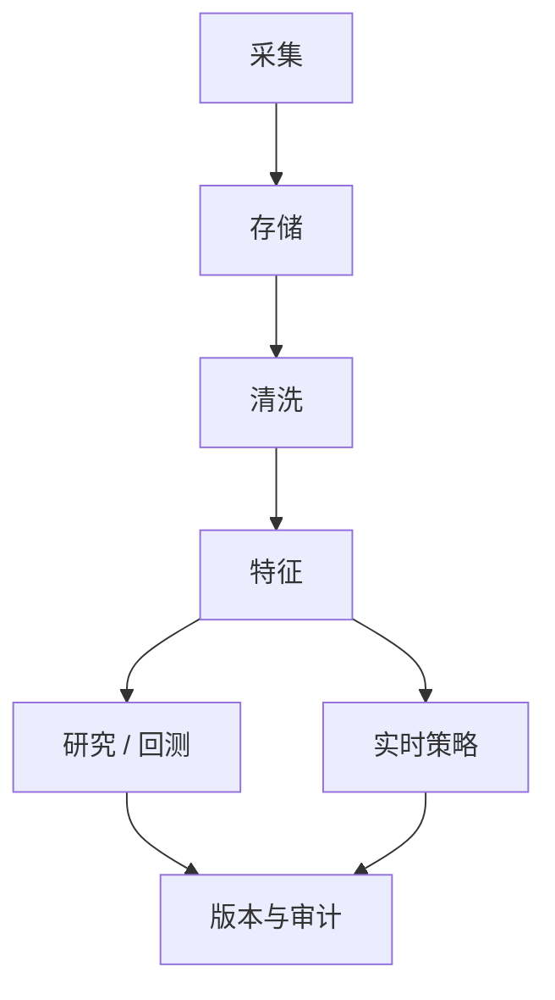
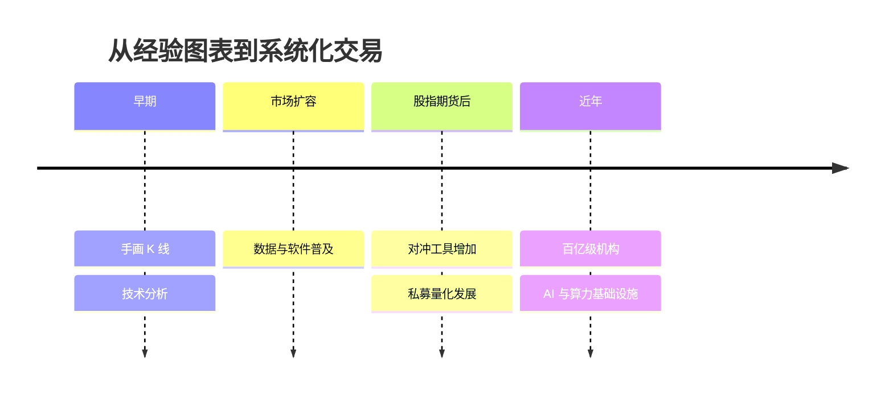
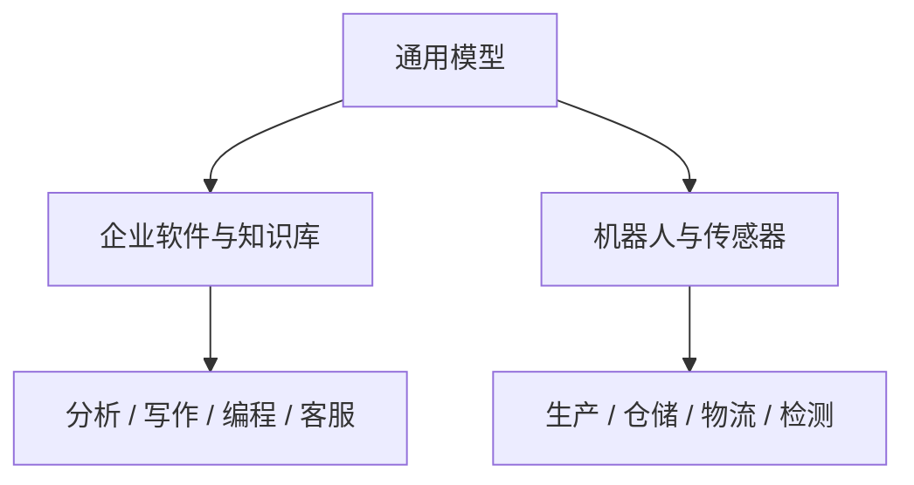
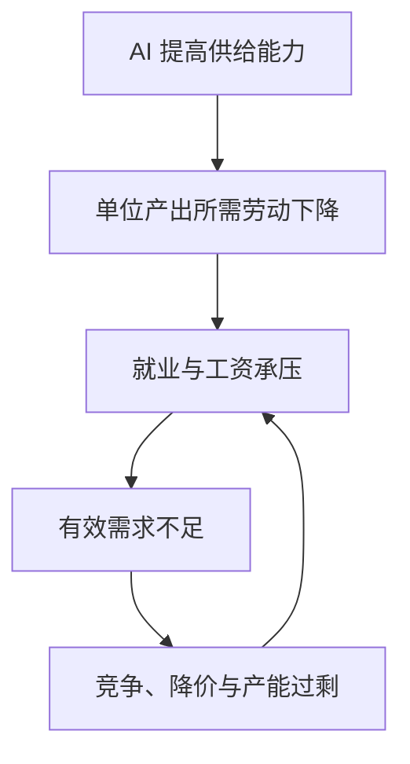

# 量化投资与 AI

## 技术、产业与未来

讲者姓名 · 机构名称 · 2026

<!--
开场建议：这不是一场“荐股课”，也不是一场单纯介绍 AI 工具的课。
我们试图回答三个问题：量化投资如何运转？AI 正在改变什么？普通人的机会在哪里？
-->

---
layout: center
class: text-center
---

# 三个问题

  
<b>量化是什么？</b> 它如何把信息变成交易？

  
<b>AI 改变什么？</b> 效率、岗位，还是竞争规则？

  
<b>机会在哪里？</b> 模型之外还有哪些壁垒？

---
layout: section
---

# 先认识一下现场

---

# 听众小调研

请举手，或者现场扫码投票：

- 用 AI 做过研究或写报告？
- 用过 ChatGPT、Claude 等国外模型？
- 用 AI 写过程序？
- 炒过 A 股？
- 用 AI 辅助过投资？

根据现场情况，可插入 5–10 分钟演示：资料整理、数据分析、代码生成，或一份“AI 研报”的现场审查。

<!-- 演示时重点展示：AI 的速度、可迭代性，以及它会自信犯错。 -->

---
layout: section
---

# 第一部分

## 量化投资是什么

---

# 从“看数字”到“自动决策”

量化投资不是简单地“用电脑炒股”，而是把投资过程尽量表达为可计算、可检验、可执行的规则。

核心差别不在于“有没有数字”，而在于自动化程度，以及人在决策链条中保留多少干预权。

---

# 广义与狭义的量化

| | 广义量化 | 狭义量化 |
|---|---|---|
| 信息 | 数据、财报、新闻、图表 | 结构化数据与可计算信号 |
| 决策 | 人主导，模型辅助 | 模型主导，人工设定边界 |
| 执行 | 人工或半自动 | 高度自动化 |
| 优势 | 灵活、能处理非常规情境 | 纪律性、可扩展、可回测 |
| 风险 | 情绪与认知偏差 | 模型失效与系统性错误 |

现实中的机构通常位于两者之间，而不是非黑即白。

---

# 一家量化机构如何分工

  
<b>投研</b> 策略研发 组合管理 风险管理

  
<b>工程与数据</b> 数据平台 交易系统 运营维护

  
<b>业务支持</b> 市场与产品 合规与法务 行政、财务、人事

真正的策略收益，往往是研究、数据、工程和交易执行共同生产出来的。

---

# 市场、频率与收益来源

  
<b>交易什么</b> 股票、债券 期货、期权 外汇与其他资产

  
<b>持有多久</b> 中低频 中高频 高频交易

  
<b>赚什么钱</b> 趋势 相对价值与套利 流动性与风险溢价

<!-- 可强调：频率越高，对延迟、成本、容量和基础设施的要求通常越高。 -->

---

# 常见量化产品（一）

| 类型 | 核心思路 | 主要挑战 |
|---|---|---|
| 多因子选股 | 用价值、质量、动量等特征解释收益差异 | 因子拥挤、风格切换 |
| 指数增强 | 控制相对基准风险，争取稳定超额收益 | 跟踪误差与交易成本 |
| 统计套利 | 捕捉资产间短期偏离与均值回归 | 关系突变、容量有限 |
| 事件驱动 | 围绕公告、重组、业绩等事件交易 | 事件识别与因果混淆 |

---

# 常见量化产品（二）

| 类型 | 核心思路 | 主要挑战 |
|---|---|---|
| CTA / 管理期货 | 跨期货品种捕捉趋势或风险溢价 | 震荡期回撤、参数稳定性 |
| 高频交易 | 从极短期价格与订单流中提取微弱信号 | 延迟、成本、基础设施 |
| 做市策略 | 持续双边报价，赚取价差并管理库存 | 逆向选择、尾部风险 |

策略名称只是标签。理解一项策略，要继续追问：收益从谁那里来？承担了什么风险？为什么尚未被竞争抹平？

---
layout: center
class: text-center
---

# 一个通用判断框架

## 收益 = 信息优势 × 转化效率 × 执行能力 − 成本 − 风险损失

---
layout: section
---

# 第二部分

## 数据：量化投资的核心资产

---

# 为什么数据如此重要

- 数据是市场状态的记录，也是模型能够读取的信息边界
- 同一个算法，输入数据的质量、时点和覆盖范围不同，结果可能完全不同
- “更多数据”不一定等于“更多信息”：重复、污染和泄漏会制造虚假的确定性

模型只能从它看见的世界中学习。数据决定了它看见什么，也决定了它看不见什么。

---

# 量化投资中的主要数据

  
<b>市场公开数据</b> 行情、成交、订单簿、公司公告、财务数据

  
<b>卖方与预期数据</b> 研报、盈利预测、评级及其修正

  
<b>舆情数据</b> 新闻、股吧、微博、社交媒体与搜索行为

  
<b>另类数据</b> 卫星、物流、招聘、门店、供应链等

---

# 数据从哪里来

- 交易所、上市公司、政府统计部门
- 专业金融数据商
- 新闻媒体与互联网平台
- 企业运营数据
- 第三方另类数据供应商
- 开源数据平台

除了价格，还要计算授权、稳定性、可追溯性、合规边界和长期维护成本。

---

# 非同质化数据为什么值钱

公开且标准化的数据会被大量机构同时使用，优势容易衰减。

  
<b>高同质化</b> 容易获得、格式统一、竞争拥挤 信息增量往往较低

  
<b>低同质化</b> 采集困难、处理复杂、覆盖独特 可能具有更高信息密度

真正的壁垒常常不只是“拥有数据”，而是知道数据在当时何时可得、如何生成、哪里会错。

---

# 一个细节：舆情数据的时间戳

一条帖子显示“10:00 发布”，并不代表研究者在 10:00 就能使用它。

- 回测必须使用“策略实际可见时间”，否则会发生未来数据泄漏
- 编辑、删除、转发和时区也会改变数据语义
- 落地时间的准确性本身，就可能构成数据壁垒

---

# 盘中与盘后：两个数据世界

| | 盘中实时数据 | 盘后历史数据 |
|---|---|---|
| 目标 | 尽快驱动决策与交易 | 稳定支持研究与回测 |
| 优先级 | 低延迟、连续性、吞吐 | 正确性、完整性、可复现 |
| 常见形态 | 推送流、L2 行情、订单簿 | 文件、数据仓库、特征库 |
| 故障代价 | 错过交易或错误下单 | 研究结论失真 |

---

# L2 行情：市场不是一条价格线

L2 数据不仅记录“成交价”，还呈现盘口深度、订单变化和成交序列。

- 数据量大、更新频繁，要求低延迟和高吞吐
- 不同交易所、品种和供应商的字段语义可能不同
- 丢包、乱序、快照与增量不一致都会污染订单簿
- 保存原始数据之外，还要保存处理版本和修复记录

---

# 数据清洗：最容易被低估的研究工作

- 缺失值：是真的“没有”，还是采集失败？
- 异常值：是错误，还是市场真实发生的极端事件？
- 重复值：重复推送，还是两笔相同成交？
- 口径变化：字段名称相同，含义是否悄悄改变？

清洗不是把“不好看”的数字删掉，而是恢复数据的业务含义。

---

# 金融数据的特殊陷阱

- **复权**：连续收益与市场心理价位不能混为一谈
- **交易日**：期货夜盘会跨越自然日
- **停牌与退市**：幸存者偏差会美化回测
- **代码复用**：相同代码未必始终代表同一资产
- **极端成交**：乌龙指可能是错误，也可能是真实风险
- **可得时点**：财报日期不等于数据进入系统的日期

---

# 数据基础设施不是后台配角

大数据、数据库、低延迟、高并发只是技术名词；最终目标是让研究结果可复现、交易输入可信、问题能够追责。

---
layout: section
---

# 第三部分

## 量化行业的历史、现状与教训

---

# 从理论模型到产业

  
<b>资产定价</b> CAPM：收益与系统性风险

  
<b>衍生品定价</b> Black–Scholes：复制与无套利

  
<b>风险模型</b> BARRA：多因子分解组合风险

量化投资的发展，是金融理论、计算能力、数据供给和市场制度共同演化的结果。

---

# 成熟期的代表机构

- **D. E. Shaw**：科学研究、计算机技术与金融市场的结合
- **Renaissance / 西蒙斯**：从数据中寻找可重复的统计规律
- **Citadel**：多策略平台、风险管理与组织能力
- **Jane Street**：做市、交易文化与技术工程的深度融合

讲述人物故事时，可重点分析组织机制，而不只强调传奇收益。

---

# 中国量化的演进

<!-- 可展开“幻方与 DeepSeek”：重点不是个别公司传奇，而是量化机构积累的算力、人才和工程能力如何外溢。 -->

---

# 高速发展中的争议

  
<b>支持者</b> 提高流动性 促进价格发现 减少主观情绪

  
<b>质疑者</b> 交易公平性 波动与拥挤 “收割散户”观感

  
<b>监管者</b> 程序化交易报告 异常交易监测 系统安全与公平

讨论量化，必须区分策略类型、频率和市场环境；“量化”不是一个单一行为主体。

---

# 案例一：LTCM

- 团队拥有顶尖理论与市场经验，策略依赖价差最终收敛
- 俄罗斯债务危机后，相关性、流动性和融资条件同时恶化
- 高杠杆把暂时的价格偏离变成无法等待的生存危机

<b>教训：</b>模型可能长期正确，但机构会在“正确兑现之前”先失去资金与流动性。

---

# 案例二：次贷危机中的模型

- 历史样本低估了全国性房价下跌与违约相关性
- 复杂结构让风险在层层包装中变得不透明
- 评级、融资、抵押品价格形成相互强化的反馈

<b>教训：</b>风险不是一个静态数字。危机中，相关性、流动性和人的行为都会改变。

---

# 案例三：骑士资本

- 软件部署与旧代码激活引发异常订单
- 很短时间内造成巨额损失，公司被迫寻求救助
- 策略逻辑之外，发布流程、权限、监控与熔断同样属于风险管理

<b>教训：</b>在自动化系统里，一个工程缺陷可以比一个研究错误更快地摧毁公司。

---

# 中国市场的三个提醒

| 案例 | 表面问题 | 更深层问题 |
|---|---|---|
| 光大证券“乌龙指” | 程序异常与巨额订单 | 系统控制、信息披露与市场冲击 |
| 中行“原油宝” | 极端行情下穿仓 | 产品设计、适当性与尾部风险 |
| 市场异常价格 | 单点数据剧烈偏离 | 如何区分坏数据与真实风险 |

---

# 2013 年诺贝尔经济学奖的启示

同一年获奖的研究，可以分别支持“市场很难战胜”和“价格会偏离基本面”的理解。

- Eugene Fama：资产价格中迅速反映信息
- Robert Shiller：价格存在长期波动与可预测成分
- Lars Peter Hansen：如何检验资产定价模型

市场既有效，又不完美；正因为竞争持续存在，任何规律都可能在被发现后衰减。

---
layout: center
class: text-center
---

# 六个案例，共同指向什么？

## 模型风险 + 杠杆风险 + 流动性风险 + 工程风险 + 制度风险

---
layout: section
---

# 第四部分

## AI 如何进入量化投资

---

# AI 在策略研究中的应用

- 快速阅读论文、公告、研报和新闻
- 生成研究假设，并梳理可证伪条件
- 辅助写数据处理、回测和可视化代码
- 从文本中抽取事件、主体、情绪和关系
- 自动形成研究记录、测试清单与复盘报告

AI 可以压缩“从问题到实验”的时间，但不能自动保证实验设计正确。

---

# AI 在系统开发中的应用

  
<b>开发阶段</b> 代码生成与重构 接口与测试用例 文档和迁移脚本

  
<b>运行阶段</b> 日志归因 异常检测 运维知识检索

金融系统仍需要代码审查、隔离环境、权限控制、回放测试与人工批准。

---

# AI 在合规与风控中的应用

- 对交易行为进行模式识别与异常筛查
- 对策略、代码和参数变更形成审计线索
- 检索监管规则，辅助生成合规检查表
- 汇总风险暴露，生成面向不同角色的解释

高风险场景的正确姿势通常不是“让 AI 最终决定”，而是让它扩大人的检查范围，并保留责任链。

---

# 一次 AI 辅助研究的正确流程

必须检查：数据泄漏、过拟合、交易成本、容量、极端行情、解释与可复现性。

---

# AI 擅长什么，不擅长什么

| AI 擅长 | AI 容易出错 |
|---|---|
| 快速生成多个候选方案 | 把相关性误当因果 |
| 处理大量文本与代码 | 引用不存在的资料或字段 |
| 遵循明确标准做初筛 | 忽略隐含业务约束 |
| 在反馈中快速迭代 | 对罕见极端情形过度自信 |

---

# 人才结构正在变化

- 编程门槛下降，但“判断代码是否正确”的要求上升
- 对金融机制、数据生成过程和风险的理解更重要
- 标准化的初级研究任务更容易被自动化
- 高级研究者借助 AI，可以覆盖过去需要多人完成的链条

价值正在从“亲手完成每一步”，转向“提出好问题、建立约束、验证结果并承担责任”。

---

# 组织方式也会变化

  
<b>团队</b> 研究团队小型化 投研、技术、数据进一步融合

  
<b>公司</b> 高级人才杠杆增强 分配机制重新调整 AI 基础设施成为竞争要素

---

# 当大家都能用同一种模型

真正的竞争优势可能来自：

1. 独特且合规的数据
2. 对市场机制的深入理解
3. 把想法变成稳定系统的工程能力
4. 更快、更严格的验证与反馈闭环
5. 资金、渠道、交易成本与组织文化

通用模型会降低“产生一个想法”的成本，却可能提高验证、执行和差异化的相对价值。

---
layout: section
---

# 第五部分

## 从量化行业看 AI 对经济的影响

---

# 大模型的本质：一种直观解释

- 人类知识大量通过文字、图像、音视频表达
- 这些内容可以被数字化，并表示为机器可处理的符号
- 训练阶段：模型从海量样本中压缩复杂的统计联系
- 推理阶段：结合上下文，逐步生成最可能且符合约束的输出

它不是数据库式的“背答案”，也不是人类心智的简单复制；更适合把它理解为一个巨大的、可被上下文调用的模式系统。

---

# 为什么这次冲击首先落到脑力劳动

- 知识工作的大量输入和输出，本来就是文本、数字和图像
- 许多工作流程可以被拆成检索、归纳、生成、检查
- AI 的复制成本低，能力升级可以快速扩散
- 与软件、数据库和企业流程结合后，它不再只是聊天工具

---

# 哪些初级岗位更容易受冲击

- 工作内容高度标准化
- 主要负责资料搜集和初步加工
- 结果容易由上级审核
- 输入输出高度依赖文本和数字
- 企业容易比较人工与 AI 的成本
- 高级人员可借助 AI 自行完成原有委派工作

“岗位受冲击”通常先表现为招聘减少、团队缩编和任务重组，不一定立即表现为整个职业消失。

---

# 从脑力劳动到体力劳动

真正的产业影响，来自模型与流程、数据、硬件和组织制度的结合。

---

# 一个需要谨慎表达的判断

> AI 是否会“只消灭岗位、不创造足够的新岗位”？目前仍是一个开放问题。

- 乐观观点：新技术降低成本、扩大需求，并创造新产品和新职业
- 悲观观点：AI 的通用性和复制速度，使新增需求难以吸收被替代劳动
- 更稳妥的近期判断：岗位结构和收入分配的变化，可能快于劳动力转型速度

---

# 当前增长：投资拉动还是生产率提升？

观察 AI 对经济的影响，需要把三件事分开：

1. **建设投入**：芯片、数据中心、电力、网络和人才
2. **企业采用**：AI 是否真正进入日常流程
3. **收益兑现**：收入增长、成本下降和全要素生产率提升

投资热潮可以先于生产率改善，也可能制造估值与产能错配。

---

# 美国：几个值得追踪的指标

  
<b>宏观投资</b> 数据中心、软件和设备投资对总投资增量的贡献

  
<b>经济增长</b> AI 相关资本形成对 GDP 增量的贡献

  
<b>市场集中</b> 头部科技公司占美股总市值的比例

  
<b>盈利兑现</b> AI 资本开支最终转化为收入和利润的速度

演讲前复核原提纲数字：116%、21%、31%、58%。需统一统计区间、AI 投资口径及“七姐妹”定义，并补充来源。

---

# 中国：从出口与产业链观察

- 关注集成电路出口的数量、金额与单价变化
- 区分周期复苏、价格因素与 AI 需求拉动
- 同时观察算力基础设施、国产软硬件和行业采用率

演讲前复核原提纲数字：2026 年前 5 个月集成电路出口量同比 +8.7%、出口额同比 +90%。尤其检查单位、基期、统计口径与数据发布日期。

---

# 头部企业的“冰火两重天”

- AI 研究、工程和产品岗位出现高薪争夺
- 非核心业务与可标准化岗位持续收缩
- 资本和人才向少数平台、模型与基础设施集中
- 同一家公司内部，扩张和裁员可以同时发生

这不仅是就业数量变化，也是企业内部议价权和收入分配的变化。

---

# 行业案例：共同机制，不同速度

| 行业 | 优先被改造的任务 | 尚难替代的部分 |
|---|---|---|
| IT 外包 | 基础编码、测试、文档 | 复杂系统与客户责任 |
| 投资银行 | 资料搜集、模型初稿、材料制作 | 交易判断与客户关系 |
| 游戏美术 | 概念草图、素材变体 | 风格统一与最终艺术决策 |
| 律所 | 检索、合同初审、摘要 | 高风险判断与法律责任 |

---

# 效率提升，为什么不等于利润增长

- 节约的时间可能被竞争转化为更低价格，而非更高利润
- 模型推理、数据治理和系统改造都有持续成本
- 产品容易复制时，效率红利会快速扩散给全行业
- 企业还要承担准确性、版权、隐私、安全与合规风险

Token 成本只是显性成本；真正昂贵的往往是把 AI 可靠地嵌入生产流程。

---

# 对未来的三阶段假设

- 短期：资本开支与资产价格成为主要推动力
- 中期：效率提高，同时伴随岗位调整和收入分化
- 长期：生产率红利能否转化为广泛需求，取决于分配、教育和社会保障

---

# 生产过剩的风险链条

这是一种可能的宏观机制，不是必然结果；财政、分配制度和新需求创造会改变链条。

---
layout: section
---

# 第六部分

## AI 时代，机会在哪里

---

# 现实起点：普及并不等于深度使用

- 很多人体验过聊天，但尚未形成稳定工作流
- 企业采购模型，不等于完成数据、权限和流程改造
- 真正的价值往往出现在具体、重复、可验证的任务中
- 行业知识与落地能力仍然稀缺

---

# 机会一：AI 向具体行业渗透

不是所有任务都需要最顶级、最昂贵的通用模型。

  
<b>小模型</b> 成本低、延迟低 适合明确任务

  
<b>专用模型</b> 结合行业数据 强化专业能力

  
<b>端侧模型</b> 隐私、离线 贴近设备与现场

---

# 机会二：以人为本的工作

- 情感沟通、信任建立与长期关系
- K12 教育中的人格培养、动机和陪伴
- 养老陪护中的尊严、安全与现实世界互动
- 需要承担责任、协调利益和处理模糊情境的工作

AI 越能完成标准化认知任务，人类的关系能力、价值判断和责任承担就越显重要。

---

# 给个人的行动建议

1. 选一个真实工作任务，而不是只学提示词
2. 把任务拆成“输入—处理—输出—验证”
3. 建立自己的资料、模板和检查清单
4. 学会验证：来源、数字、代码和边界条件
5. 深耕一个行业，让 AI 放大你的专业判断

---

# 给企业的行动建议

- 从高频、耗时、可审核的流程开始
- 先明确数据权限、责任边界与失败处置
- 计算端到端成本，而不只比较模型价格
- 建立小规模试点，用业务指标而非演示效果验收
- 把人的复核与反馈设计进系统，而非事后补丁

---
layout: center
class: text-center
---

# 最后回到量化投资

## AI 会让工具更普及，但不会消灭稀缺性

稀缺性将更多转移到数据、判断、执行、组织与责任。

---

# 今天的三个结论

1. **量化不是预测机器**：它是数据、模型、工程、交易与风控组成的系统
2. **AI 不是免费的阿尔法**：它提高研究效率，也加速策略同质化与竞争
3. **机会来自落地差异**：行业知识、专有数据、验证能力和人的关系仍然关键

---
layout: center
class: text-center
---

# 谢谢

## Q & A

联系方式 / 公众号 / 二维码

---
layout: section
---

# 附录

## 备用页与演讲前检查

---

# 建议准备的现场演示

任选一个，控制在 5–10 分钟：

- 把一份公告转化为结构化事件表，再人工核查
- 让 AI 写一个简单回测，然后现场寻找数据泄漏
- 比较“直接问荐股”与“建立研究检查表”的结果
- 用同一问题演示：无资料回答、给资料回答、带验证回答

---

# 演讲前事实核查清单

- [ ] 所有“当前、近年、今年”的表述是否仍然成立？
- [ ] 美国 AI 投资和“七姐妹”数据是否统一年份与口径？
- [ ] 中国集成电路出口数据是否已有官方完整月份数据？
- [ ] 监管政策是否更新？程序化交易规则是否需要补充？
- [ ] 公司、行业裁员案例是否有可靠来源且避免以偏概全？
- [ ] 案例中的损失金额和时间线是否需要精确数字？

---

# 可继续补充的素材

- 每个历史案例增加一张时间线或公开资料截图
- 增加一个完整量化策略示例：假设、数据、回测、失效
- 增加 AI 生成错误代码或虚假引用的现场案例
- 根据听众背景，加入“个人投资者如何正确使用 AI”
- 最后一页加入延伸阅读和全部数据来源

